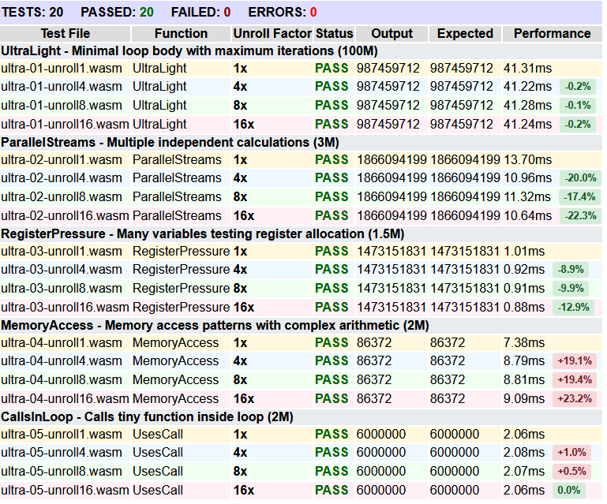

# Tubular WebAssembly Compiler

## Key Features

### Language Support

- Complete type system with int, double, char, string types
- Control flow: if/else, while loops, break/continue statements
- First-class functions with recursion support
- String operations: concatenation, repetition, indexing
- Type casting with implicit and explicit conversions

### Optimization Passes

1. **Function Inlining** - Smart inlining for small functions with size-based heuristics
2. **Loop Unrolling** - Advanced loop optimization with configurable unroll factors (1x, 4x, 8x, 16x)
3. **Tail Recursion Elimination** - Converts tail-recursive calls to iterative loops using dependency analysis (Work in Progress, also need to write better tests.)

### Performance Analysis

- Comprehensive benchmarking infrastructure with statistical timing
- Browser-based performance testing with interactive visualizations
- Quantitative results showing up to 22% execution time improvements
- CSV export capabilities for research data collection



## Architecture

The compiler follows a traditional three-phase design with modern C++ implementation:

```
Source (.tube) → Frontend → Middle-end → Backend → WebAssembly (.wat/.wasm)
```

- **Frontend**: Lexical analysis, parsing, AST construction
- **Middle-end**: Optimization passes and program analysis
- **Backend**: WebAssembly code generation

## Quick Start

### Prerequisites

```bash
sudo apt install wabt

wget https://github.com/bytecodealliance/wasmtime/releases/latest/download/wasmtime-*-linux.tar.xz
tar xf wasmtime-*-linux.tar.xz && sudo cp wasmtime-*/wasmtime /usr/local/bin/
```

### Building

```bash
./make              # Build the compiler
./make test         # Run complete test suite
./make clean        # Clean generated files
```

### Basic Usage

```bash
# Basic compilation
./build/Tubular program.tube             # Generate program.wat
wat2wasm program.wat                     # Generate program.wasm
wasmtime program.wasm                    # Execute

# With optimizations
./build/Tubular program.tube --unroll-factor=8 --no-inline --tail=loop
```

## Testing Infrastructure

### Comprehensive Test Coverage

- **Language tests** covering all features and edge cases
- **Optimization-specific test suites** with performance benchmarks

### Browser-Based Performance Testing

Interactive testing interfaces provide real-time performance analysis:

- Loop unrolling performance comparison across different factors
- Function inlining before/after analysis
- Tail recursion optimization measurement

## Performance Results

Current optimization impact measured across representative workloads:

| Optimization      | Best Case Improvement | Test Coverage          |
| ----------------- | --------------------- | ---------------------- |
| Loop Unrolling    | 22% faster execution  | 4 performance tests    |
| Function Inlining | Measurable gains      | 6 test scenarios       |
| Tail Recursion    | Stack usage reduction | 5 recursive algorithms |

## Documentation

- **[SPECS.md](SPECS.md)** - Complete language specification
- **[TESTING.md](TESTING.md)** - Testing infrastructure and procedures

### Current Status

- Core compilation pipeline: Complete and tested
- Optimization passes: Fully implemented with measurable results (tail recursion is WIP)
- Performance infrastructure: Comprehensive timing and analysis tools
- Documentation: Professional-grade technical documentation

### Future Directions

- Autotuning framework for systematic optimization exploration
- hopefully🤞 Machine learning-guided optimization parameter selection
- Extended language features and additional optimization passes
